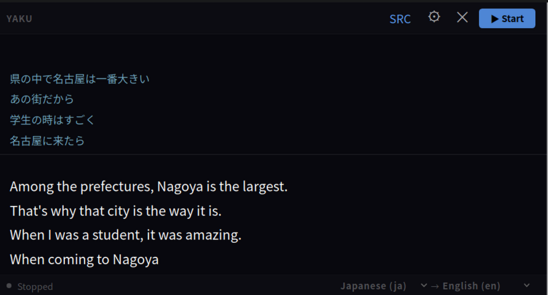

# yaku

[](https://github.com/opdude/yaku/actions/workflows/ci.yml)

A frameless desktop overlay that transcribes live system audio and translates it in real time — designed for watching foreign-language streams, videos, or calls without subtitles.

Audio is captured from the system's default output (loopback), transcribed by [whisper.cpp](https://github.com/ggerganov/whisper.cpp), translated by a locally-running [Ollama](https://ollama.com) model, and displayed as streaming subtitles in an always-on-top overlay window.

---

## Features

- **Continuous capture** — audio is captured without gaps; transcription and translation run while the next chunk is already being buffered
- **Streaming transcription** — partial whisper segments appear word-by-word as the model decodes
- **Streaming translation** — Ollama tokens stream into the overlay in real time
- **GPU acceleration** — Vulkan (default) or CUDA; the active backend is shown at startup
- **Always on top** — stays visible over fullscreen windows
- **Inline language selector** — change source/target language from the status bar; saved automatically

---

## Screenshot



The overlay displays source text (Japanese) in the top panel, live translation (English) below. Drag the header to reposition; use controls to toggle source view, access settings, or stop transcription.

---

## Requirements

### Runtime

| Dependency | Purpose |
|---|---|
| [Ollama](https://ollama.com/install) | Local LLM for translation |
| WebKit2GTK 4.1 | Web renderer (part of GNOME/KDE stack, usually pre-installed) |
| Vulkan loader | GPU acceleration |
| PipeWire or PulseAudio | System audio capture |

> The AppImage bundles most dependencies. WebKit2GTK and GStreamer must come from the system.

### Whisper models

Models are stored in `~/.cache/yaku/models/` and are not bundled.

| Model | Size | Notes |
|---|---|---|
| `ggml-tiny.bin` | 75 MB | Fastest, lowest accuracy |
| `ggml-base.bin` | 142 MB | Good for quick testing |
| `ggml-small.bin` | 466 MB | Balanced |
| `ggml-medium.bin` | 1.5 GB | Good accuracy |
| `ggml-large-v3-turbo.bin` | 874 MB | Fast and accurate (recommended) |
| `ggml-large-v3.bin` | 3.1 GB | Best accuracy |

---

## Installation

### AppImage (recommended)

1. Download the AppImage from the [Releases page](../../releases).
2. Make it executable and run:
   ```sh
   chmod +x yaku-*.AppImage
   ./yaku-*.AppImage
   ```
3. On first launch the app shows a model selection screen — choose and download a model directly from the UI.

### From source

See [Developer setup](#developer-setup) below.

---

## First-time setup

### 1 — Choose a whisper model

On first launch the app shows a model selection screen. Pick a size and click **Download** — the model is fetched from HuggingFace and saved to `~/.cache/yaku/models/` automatically. If you already have a `.bin` file, click **Use an existing model file** to point directly to it.

### 2 — Pull an Ollama translation model

[TranslateGemma](https://ollama.com/library/translategemma) is purpose-built for translation and is recommended:

```sh
ollama pull translategemma:4b    # 3.3 GB — fast, good quality
ollama pull translategemma:12b   # 8 GB   — higher quality
```

General-purpose models also work (`llama3.2`, `qwen2.5:7b`, etc.) but produce lower translation quality.

---

## Usage

### Overlay controls

| Control | Action |
|---|---|
| `SRC` | Toggle source-language panel (resizes window) |
| `⚙` | Open settings |
| `✕` | Close |
| `▶ Start` / `■ Stop` | Start or stop the pipeline |

Drag the **header bar** to move the window.

### Status bar

Shows the pipeline state (Listening / Transcribing / Translating) and the active language pair. Click either language code to change it immediately — changes are saved automatically.

### Settings

| Setting | Description |
|---|---|
| Source / target language | Language pair for transcription and translation |
| Ollama model | Model to use for translation |
| Ollama URL | Defaults to `http://localhost:11434/api/generate` |

Config is saved to the platform config directory (`~/.config/yaku/` on Linux, `~/Library/Application Support/yaku/` on macOS, `%AppData%\yaku\` on Windows).

---

## Developer setup

### Prerequisites

**Debian / Ubuntu:**
```sh
sudo apt-get install cmake glslc libvulkan-dev libgomp-dev g++ pkg-config \
                     libgtk-3-dev libwebkit2gtk-4.1-dev golang-go
```

**Fedora / RHEL:**
```sh
sudo dnf install cmake glslc vulkan-loader-devel libgomp-devel gcc-c++ pkgconf \
                 gtk3-devel webkit2gtk4.1-devel golang
```

Install [Task](https://taskfile.dev/installation/):
```sh
go install github.com/go-task/task/v3/cmd/task@latest
```

> The Wails CLI is installed automatically the first time you run `task` or `task dev`.

### Build

```sh
git clone --recurse-submodules https://github.com/opdude/yaku
cd yaku
task              # compiles whisper.cpp on first run (~2 min), then builds the app
```

Output lands in `./bin/`.

### Task targets

| Command | Description |
|---|---|
| `task` | Build `bin/yaku` (Vulkan GPU) |
| `task dev` | Wails dev mode with live frontend reload |
| `GPU=cuda task` | Build with CUDA acceleration |
| `task appimage` | Build a self-contained AppImage |
| `task test` | Run unit tests |
| `task clean` | Remove build output |
| `task clean-all` | Remove build output and compiled whisper libs |

### Architecture

```
audio.Capturer.Stream()              platform audio capture
        │
        ▼  500 ms increments, rolling 10 s window
  silence gate (VAD)
        │
        ▼  when ≥ ChunkSeconds of speech detected
  transcribe.Transcriber.Transcribe()    whisper.cpp via CGO
        ├─ segment callbacks → live source text
        └─ final text
              │
              ▼
  translate.Stream()                 Ollama NDJSON streaming
        └─ token callbacks → overlay events
```

Capture, transcription, and translation are pipelined: while Ollama translates chunk N, the audio buffer is already filling with chunk N+1.

### Project layout

```
cmd/yaku/       Wails entry point, Go↔JS bridge (App struct)
  frontend/                HTML/CSS/JS overlay UI
internal/
  audio/                   Capturer interface, VAD, PCM conversion; platform implementations
  config/                  Config struct, YAML persistence
  transcribe/              whisper.cpp CGO wrapper, GPU backend detection
  translate/               Ollama streaming, context-aware prompt construction
third_party/whisper.cpp/   git submodule, compiled by `task whisper`
build/                     AppImage scripts and whisper build output
```

---

## Release procedure

Releases are created automatically when a `v*` tag is pushed:

```sh
git tag v1.2.3
git push origin v1.2.3
```

The [release workflow](.github/workflows/release.yml) builds a Vulkan AppImage via GoReleaser and uploads it to the GitHub release.
